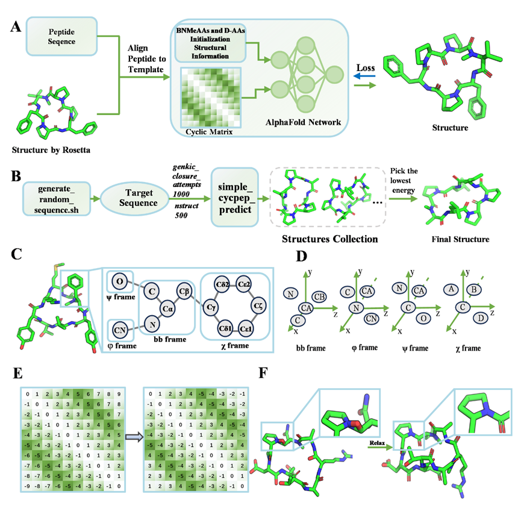

# HighFold-MeD

After deploying the corresponding environment and code, execute the following command for training:

nohup python run_finetuning.py --data_dir ./alphafold_params --train_dataset ./datasets_alphafold_finetune_cyclic/train_2500_fape.tsv --valid_dataset ./datasets_alphafold_finetune_cyclic/valid_2500_fape.tsv > run_finetuning_2500.log>&1 &

Predictive Instructions:

nohup python run_prediction_batch.py > run_prediction_2500.log 2>&1 &

relaxed:

Enter the realxed folder and execute:relaxed.py

